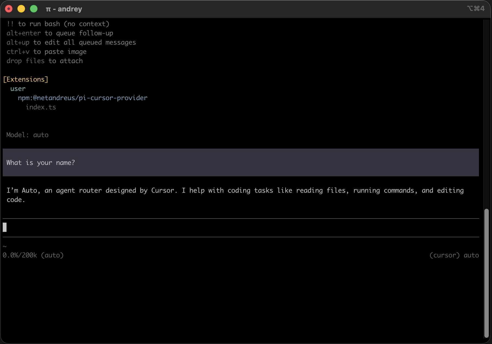

<div align="center">
  
</div>

# pi-cursor-provider

[](https://www.typescriptlang.org/)
[](LICENSE)
[](https://nodejs.org)
[](https://github.com/badlogic/pi-mono)
[](https://cursor.com)

A [Pi Coding Agent](https://github.com/badlogic/pi-mono) custom provider that routes model requests through the **Cursor Agent CLI**, enabling you to use any model available on your Cursor subscription — Claude (Opus, Sonnet), GPT, Gemini, Grok, and more — from inside Pi.

No separate API keys are needed for the models themselves. Authentication is handled by the Cursor CLI using your existing Cursor account.



---

## Contents
- [pi-cursor-provider](#pi-cursor-provider)
  - [Contents](#contents)
  - [Prerequisites](#prerequisites)
  - [Installation](#installation)
    - [Option A — Install from npm (recommended)](#option-a--install-from-npm-recommended)
    - [Option B — Install from source](#option-b--install-from-source)
    - [Option C — Try without installing](#option-c--try-without-installing)
  - [Uninstall](#uninstall)
    - [Option A — Installed from npm (recommended)](#option-a--installed-from-npm-recommended)
    - [Option B — Installed from source](#option-b--installed-from-source)
  - [Authentication](#authentication)
    - [First-time setup](#first-time-setup)
    - [Auth commands inside Pi](#auth-commands-inside-pi)
    - [Verify auth](#verify-auth)
  - [Usage](#usage)
  - [Available models](#available-models)
    - [Model reference table](#model-reference-table)
  - [Configuration](#configuration)
  - [How it works](#how-it-works)
  - [Tool calls](#tool-calls)
  - [Installing and enabling MCP tools in Cursor Agent for Pi](#installing-and-enabling-mcp-tools-in-cursor-agent-for-pi)
  - [Image input](#image-input)
  - [Limitations](#limitations)
  - [Troubleshooting](#troubleshooting)
  - [References](#references)
  - [License](#license)


---

## Prerequisites

| Requirement | Details |
|---|---|
| [Pi Coding Agent](https://github.com/badlogic/pi-mono) | `npm install -g @mariozechner/pi-coding-agent` (v0.53.0+) |
| [Cursor Agent CLI](https://cursor.com/docs/cli/overview) | Installed and available on `PATH` (or provide the path via `CURSOR_AGENT_PATH`) |
| Cursor account | Free or paid; available models depend on your subscription |

---

## Installation

### Option A — Install from npm (recommended)

```bash
pi install npm:@netandreus/pi-cursor-provider
```

Or for project-local install:

```bash
pi install npm:@netandreus/pi-cursor-provider -l
```

### Option B — Install from source

From the repository root:

```bash
git clone https://github.com/netandreus/pi-cursor-provider.git
cd pi-cursor-provider
pi install .
```

### Option C — Try without installing

```bash
pi -e npm:@netandreus/pi-cursor-provider
```

## Uninstall

### Option A — Installed from npm (recommended)
```bash
pi remove npm:@netandreus/pi-cursor-provider
```

### Option B — Installed from source
```bash
# You can find installed path right after running "pi"
pi remove ~/sandbox/pi-cursor-provider
```
---

## Authentication

The provider delegates authentication entirely to the Cursor CLI. Your Cursor credentials are stored and managed by the CLI itself (`~/.cursor/`).

### First-time setup

```bash
# Option 1 — Interactive browser-based login (recommended)
agent login

# Option 2 — API key
export CURSOR_API_KEY=your_cursor_api_key
```

If `CURSOR_API_KEY` is set it is forwarded to every `agent` subprocess via `--api-key` automatically.

### Auth commands inside Pi

After loading the extension you can manage auth without leaving Pi. These commands appear in the command palette (e.g. when you type `/cur`):

| Command | Description |
|---|---|
| `/cursor-login` | Log in to Cursor (runs `agent login`) |
| `/cursor-status` | Show Cursor authentication status (runs `agent status`) |
| `/cursor-logout` | Log out of Cursor (runs `agent logout`) |

### Verify auth

```bash
agent status
# or inside Pi:
# /cursor-status
```

Expected output when authenticated:
```
 ✓ Logged in as you@example.com
```

---

## Usage

After loading the extension, select a Cursor model with the `/model` command:

```
/model cursor/auto
/model cursor/sonnet-4.6-thinking
/model cursor/gpt-5.2
/model cursor/gemini-3-pro
```

You can also specify the model on the command line:

```bash
pi -e npm:@netandreus/pi-cursor-provider --provider cursor --model auto
```

Or pipe a prompt non-interactively:

```bash
echo "Explain the main function in this file" | \
  pi -e npm:@netandreus/pi-cursor-provider --provider cursor --model sonnet-4.6
```

---

## Available models

At startup the extension runs `agent models` to discover the **account-specific** model list from your Cursor subscription. The list is cached for the lifetime of the Pi session.

If discovery fails (e.g. the CLI is not installed, not authenticated, or times out), a built-in static fallback list is used automatically — no crash, no user action needed.

To see the models currently available to your account:

```bash
agent models
```

Models whose id contains `-thinking`, `-high`, `-xhigh`, or `-max-high` are marked as reasoning models in Pi. All other metadata (contextWindow, maxTokens) is derived from the static lookup table or set to safe defaults (200k context / 32k max tokens) for models not in the table.

When you use a **canonical ID** (e.g. `claude-sonnet-4-5`), the provider can send the thinking variant to the CLI when Pi’s reasoning level is enabled.

### Model reference table

Subset of models supported by the provider. Use the **Canonical ID** with `/model cursor/<id>`. The full list is discoverable via `agent models`.

| Canonical ID | CLI model ID | Name | Reasoning |
|---|---|---|---|
| `auto` | `auto` | Auto | — |
| `claude-sonnet-4-5` | `sonnet-4.5`, `sonnet-4.5-thinking` | Claude 4.5 Sonnet | yes (thinking variant) |
| `claude-sonnet-4-6` | `sonnet-4.6`, `sonnet-4.6-thinking` | Claude 4.6 Sonnet | yes (thinking variant) |
| `claude-opus-4-5` | `opus-4.5`, `opus-4.5-thinking` | Claude 4.5 Opus | yes (thinking variant) |
| `claude-opus-4-6` | `opus-4.6`, `opus-4.6-thinking` | Claude 4.6 Opus | yes (thinking variant) |
| `gpt-5.2` | `gpt-5.2`, `gpt-5.2-high` | GPT-5.2 | yes (high variant) |
| `gpt-5.2-codex` | `gpt-5.2-codex`, `-low`, `-high`, `-xhigh` | GPT-5.2 Codex | yes (level variants) |
| `gpt-5.2-codex-fast` | `gpt-5.2-codex-fast`, `-low-fast`, … | GPT-5.2 Codex Fast | yes (level variants) |
| `gpt-5.3-codex` | `gpt-5.3-codex`, `-low`, `-high`, `-xhigh` | GPT-5.3 Codex | yes (level variants) |
| `gpt-5.3-codex-fast` | `gpt-5.3-codex-fast`, … | GPT-5.3 Codex Fast | yes (level variants) |
| `gpt-5.1` | `gpt-5.1-high` | GPT-5.1 High | yes |
| `gpt-5.1-codex-max` | `gpt-5.1-codex-max`, `-max-high` | GPT-5.1 Codex Max | yes |
| `gemini-3-pro-preview` | `gemini-3-pro` | Gemini 3 Pro | — |
| `gemini-3-flash-preview` | `gemini-3-flash` | Gemini 3 Flash | — |
| `grok-code-fast-1` | `grok` | Grok | — |
| `composer-1.5` | `composer-1.5` | Composer 1.5 | — |
| `composer-1` | `composer-1` | Composer 1 | — |

---

## Configuration

| Environment variable | Default | Description |
|---|---|---|
| `CURSOR_AGENT_PATH` | `agent` | Full path to the Cursor Agent CLI binary. |
| `AGENT_PATH` | `agent` | Fallback if `CURSOR_AGENT_PATH` is not set. |
| `CURSOR_API_KEY` | *(none)* | Cursor API key; passed to CLI via `--api-key` if set. |

Example:

```bash
export CURSOR_AGENT_PATH=$HOME/.local/bin/agent
pi -e npm:@netandreus/pi-cursor-provider --provider cursor --model auto
```

---

## How it works

Each Pi turn spawns a Cursor Agent CLI subprocess:

```
agent --print --output-format stream-json --model <id> --trust --workspace <cwd> "<prompt>"
```

The extension serialises the Pi conversation (system prompt + message history) into a single text prompt that is passed to the CLI. The CLI's NDJSON stdout is read line-by-line; `type: "assistant"` events are mapped to Pi stream events (`text_start`, `text_delta`, `text_end`, `done`).

- **Multi-turn context**: The full message history is serialised as a prefixed transcript (`[User] / [Assistant] / [Tool result]`) and sent as a single prompt. Cursor manages its own internal conversation from that point.
- **Token usage**: Cursor CLI does not expose token counts; usage is reported as 0.
- **Cost tracking**: Models are registered with `cost: 0` since billing goes through your Cursor subscription.

---

## Tool calls

When the Cursor CLI uses tools (Read, Write, Shell, Grep, Ls, Glob, etc.) during a turn, the extension displays those calls inline with the assistant text.

The **Cursor CLI executes all tools** itself — Pi only observes and displays them. Tool arguments and results originate in the Cursor agent's execution environment, not in Pi's tool system.

Supported Cursor CLI tools that appear in Pi's output:

| CLI event key | Display name |
|---|---|
| `shellToolCall` | Shell |
| `readToolCall` | Read |
| `editToolCall` | Edit |
| `writeToolCall` | Write |
| `deleteToolCall` | Delete |
| `grepToolCall` | Grep |
| `globToolCall` | Glob |
| `lsToolCall` | Ls |
| `todoToolCall` | Todo |
| `webFetchToolCall` | WebFetch |
| `webSearchToolCall` | WebSearch |

---

## Installing and enabling MCP tools in Cursor Agent for Pi

To use Pi-related MCP tools (e.g. `pi-auto`) when the Cursor Agent runs on behalf of Pi, connect the MCP server, enable it for the agent, and allow its tools in the CLI config.

### 1. Connect MCP server to agent

Add the server to `~/.cursor/mcp.json`. Example for `pi-auto`:

```bash
cat ~/.cursor/mcp.json
```

```json
{
  "mcpServers": {
    "pi-auto": {
      "command": "pi-auto-mcp",
      "lifecycle": "keep-alive",
      "directTools": true
    }
  }
}
```

### 2. Enable the MCP server

List MCP servers; new ones need approval:

```bash
agent mcp list
```

Example output:
```
pi-auto: not loaded (needs approval)
```

Enable and approve the server:

```bash
agent mcp enable pi-auto
```

Example output:
```
✓ Enabled and approved MCP server: pi-auto
```

Verify tools are available:

```bash
agent mcp list-tools pi-auto
```

Example output:
```
Tools for pi-auto (8):
- pi_get_priority ()
- pi_get_provider (scope, projectPath)
- pi_get_strategy ()
- pi_get_usage (period)
- pi_set_priority (priority)
- pi_set_provider (provider, model, scope, projectPath)
- pi_set_strategy (strategy)
- pi_suggest_provider (period)
```

### 3. Allow tools from this MCP

Ensure `~/.cursor/cli-config.json` allows the MCP tools. For example:

```json
"permissions": {
  "allow": [
    "Shell(ls)",
    "Mcp(pi-auto:*)"
  ],
  "deny": []
}
```

`Mcp(pi-auto:*)` lets the agent use any tool from the `pi-auto` server.

---

## Image input

The Cursor Agent CLI does **not** support image attachments in `--print` mode. When Pi messages contain images (e.g. screenshots), the provider serialises them as a textual placeholder:

```
[Image: image/png, ~48320 bytes — note: image input is not supported by the Cursor Agent CLI; the visual content cannot be passed through]
```

- The text of the conversation is still sent and a response is returned.
- The model is informed that an image was attached but cannot see its contents.
- Models are registered with `input: ["text"]` only to reflect this limitation.

Image input will be enabled automatically if a future Cursor CLI version adds an attachment flag.

---

## Limitations

- Image content cannot be passed to the model (Cursor CLI limitation — see above).
- Multi-turn history is serialised as plain text; very long conversations may exceed the model's context window.
- Token usage is always reported as 0 (the Cursor CLI does not expose token counts).

---

## Troubleshooting

| Symptom | Likely cause | Fix |
|---|---|---|
| `spawn agent ENOENT` | `agent` binary not on PATH | Set `CURSOR_AGENT_PATH=/path/to/agent` |
| Empty response / hangs | Not logged in to Cursor | Run `agent login` or set `CURSOR_API_KEY` |
| `No models available` | Cursor CLI cannot reach the API | Check internet connection and `agent status` |
| Error on a specific model | Model not in your subscription | Run `agent models` to see available models |
| NDJSON parse errors | Unexpected CLI output | Check stderr; update Cursor Agent CLI |

---

## References

- [Cursor Agent CLI — Overview](https://cursor.com/docs/cli/overview)
- [Pi](https://pi.dev/)

---

## License

[MIT](LICENSE)
